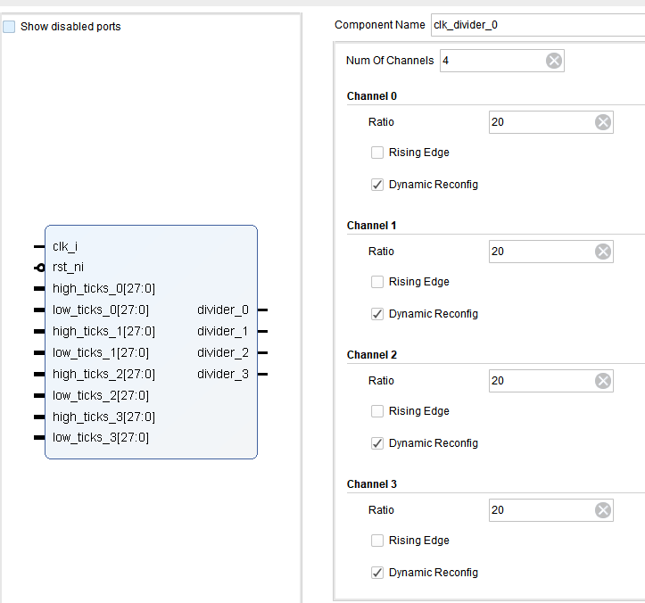
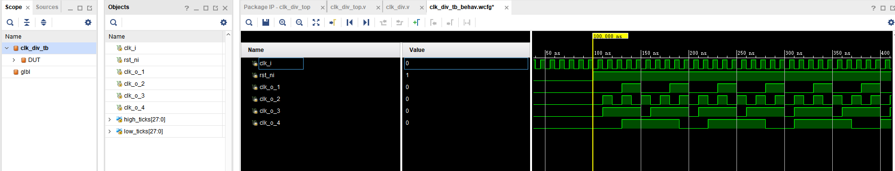

# 时钟分频器

对输入时钟进行分频，得到低频时钟，可以在block design中调用，也可以在自己的IP中引用，暂时不提供AXI Lite接口，该IP会在clk control模块被引用。

## 接口与参数定义

### 接口

1、clk_i 输入基准时钟，在该时钟的上升沿、下降沿完成触发；

2、rst_ni 低电平有效复位信号，复位输出时钟为低，计数器清0；

3、high_ticks< 3:0 > 动态配置时，divider< 3:0 >输出的高电平周期数，1表示1个周期的高电平；

4、low_ticks < 3:0 > 动态配置时，divider< 3:0 >输出的低电平周期数，1表示1个周期的低电平；

5、divider< 3:0 > 分频后的时钟

### 参数

1、Num of Channels 输出通道数量，最大值为4

2、Ratio 默认的分频比，20表示20分频，占空比50%；

3、Rising Edge==1表示输出时钟与参考时钟上升沿对齐，Rising Edge==0表示输出时钟与参考时钟下降沿沿对齐，默认下降沿对齐；

4、Dynamic Reconfig 表示当前通道是否启用动态配置。

## 工作时序

直接运行 IP中附带的仿真代码clk_div_tb可以观察输出波形，如下图所示：

1、复位时，counter清0，输出时钟为低电平；

2、复位结束后，先输出低电平，抱持指定周期后，输出指定周期高电平，循环往复。

