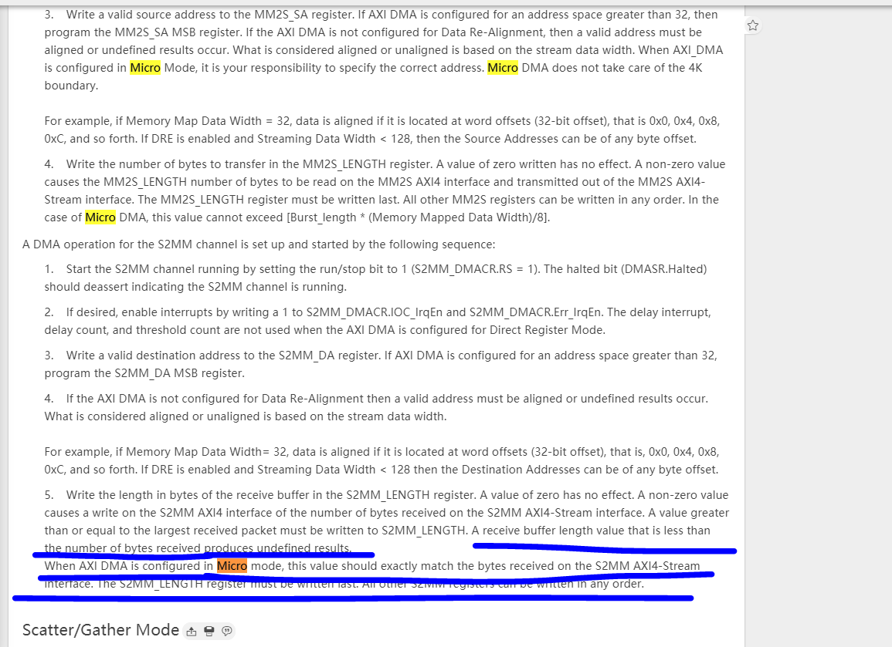

# 介绍

AXI DMA模块对输入数据有一定要求，S2MM 输入数据不允许多也不允许少，而很多情形下，输入数据实际上是源源不断的，尤其是当AXI DMA只在做简单的直接寄存器模式数据传输时更是如此。

下图是AXI DMA手册截图，可以看出，如果S2MM的数据多了之后就会出现问题。

另外，当前这种数据模式只适用于burst 类型的数据传输，不适用于长时间连续的传输，比如单次传输长度最长不能超过AXI DMA参数设置的buffer length 位宽指定的最大长度，理论最大是26bit位宽。

axi dma 使用的时候需要注意，输入stream 数据不能够有tlast 信号，因为tlast 会中断当前数据传输。

# 设计目标

 从用户角度，需要提供如下API:

int AXI_DMA_S2MM_FilterConfig(int hdev, int length);

int AXI_DMA_S2MM_FilterStart(int hdev, int length);

从调用流程上，需要先启动AXI DMA，然后启动数据源筛选模块；

从硬件接口上，数据流需要是AXI Stream 数据接口，符合axis 的接口定义；寄存器读写接口得是axi_lite接口，提供enable 寄存器，该寄存器的每一次上升沿触发一次 数据burst 过滤；

