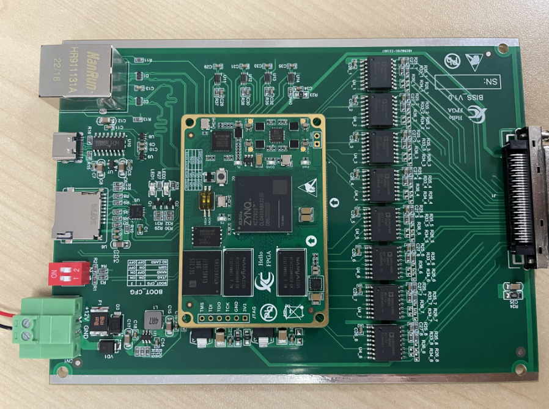

# BISS-C

This is N channel BISS-C FPGA IP and It's Driver Repo.

If it is helpful, please give our repo a star to make more people see it.

we used a ZYNQ7020 Core board and an extension BISS-C board to implement this demo, this is a 8-channel BISS-C sensor grabber demo.

## doc

Include the BISS protocol specification, sensor user manual,  BISS-C FPGA IP user manual, and the ZYNQ7020 board schematic pdf.

## IP

FPGA IP Core

## scripts

Run the build.bat to recreate the VIVADO project, you can change the VIVADO location to your own location. This demo is implemented on VIVADO2019.1

## constraints

The FPGA project constraints.

## Hardware

You can contact with us to buy one or make it by yourself, the  design files has already been open sourced and tested.

https://github.com/Hello-FPGA/ZYNQ7020_Core_Board

https://github.com/Hello-FPGA/BISS-C-Board

# QA

### Where is the software code?

We offer a standalone software demo based on Xilinx SDK 2019.1, the source code located in ./IP/BISS_C/drivers_demo

### How can we get the hardware and contact you?

You can contact us by email info@hello-fpga.com  or QQ 947559581, the price will be 3000RMB (including the power and cables), and we will sell or open source the hardware later.

### What is the sensor you tested?

Right now, we only test 2 type sensors, one is RENISHAW L-9709-9005-03-F 32bit, one is a 14bit Chinese local sensor. But we believe that all RENISHAW sensors will works well on this code. And we welcome you give us more feedback if you used our hardware or software.

